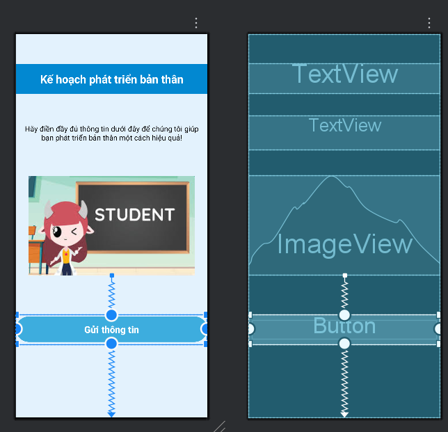

# 📱 Android App: Ứng dụng Android thu thập thông tin của sinh viên

Ứng dụng Android thu thập dữ liệu về sinh viên với mục đích đánh giá khả năng và triển vọng học thuật của họ trong tương lai.

---
## 🎬 Chương trình ứng dụng và kiểm thử

---

##  🎬 Xem tại Youtube
[](https://youtube.com/shorts/D4HyrOfUDK8)


---

## 🚀 1. Tạo Project mới trong Android Studio
Tạo một dự án mới trong **Android Studio**:


---

## 🏗️ 2. Chọn loại Activity
Chọn **Basic View Activity** để có giao diện cơ bản:


---

## ✏️ 3. Đặt tên project và chọn cấu hình Android
Nhập tên ứng dụng, package name, và chọn ngôn ngữ **Java/Kotlin**:


---

## 🖥️ 4. Màn hình chính trong Android Studio
Khi mở dự án, bạn sẽ thấy giao diện chính gồm **XML Layouts** và **MainActivity**:


---

## 🎨 5. Thiết kế giao diện (Layout)

### 🔹 Main Activity
Màn hình chính giới thiệu thông tin ứng dụng


### 🔹 GetInfo Activity (Xử lí input)
Màn hình hiển thị nơi nhập thông tin:


### 🔹 ShowInfo Activity (Hiển thị thông tin đã nhập ra màn hình)
Màn hình hiển thị thông tin sinh viên:

---

## ⚙️ 6. Cách hoạt động

1. **Hiển thị thông tin giới thiệu ứng dụng tại màn hình chính**.
2. **Khi sinh viên nhấn nút gửi thông tin sẽ chuyển tiếp đến trang nhập thông tin**
3. **Tại trang nhập thông tin, sinh viên cần nhập đầy đủ thông tin**
4. **Khi thông tin được nhập đầy đủ và nhấn nút gửi !! Nếu thông tin không đầy đủ sẽ thông báo ""Vui lòng nhập đầy đủ thông tin""**
5. **Khi thông tin đã đầy đủ và nút nhấn được kích hoạt sẽ chuyển tiếp sang màn hình show thông tin**
6. **Tại mỗi màn hình thu thập thông tin và hiển thị thông tin đều có nút trở lại trang chủ. Khi nhấn nút thì sẽ quay lại trang chủ và mọi thông tin đều được xóa**
---

## 🛠️ 7. Cách chạy ứng dụng

1. Clone repo này về máy:
   ```sh
   git clone https://github.com/Trung78z/android-app_week_3.git
   ```
2. Mở **Android Studio** và import project.
3. Chạy ứng dụng trên **Emulator** hoặc **thiết bị thật**.
4. Nhập câu cần kiểm tra.


---

## 📩 8. Liên hệ
Nếu có thắc mắc hoặc góp ý, vui lòng liên hệ qua email: `quanh.0807@gmail.com` & `trungpspy@gmail.com`.